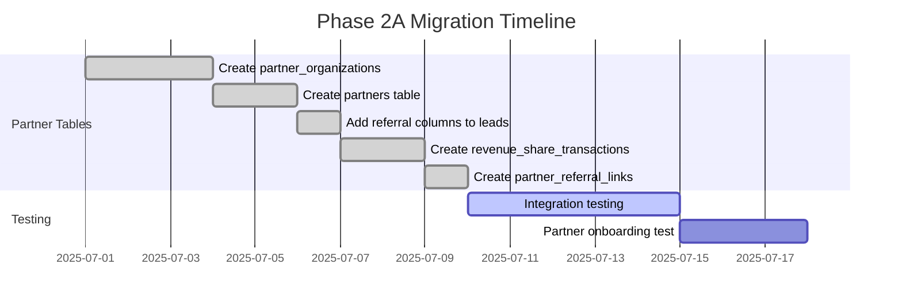
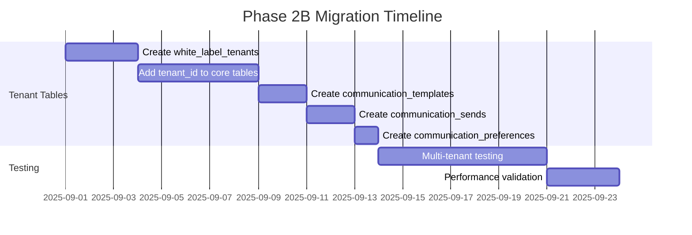
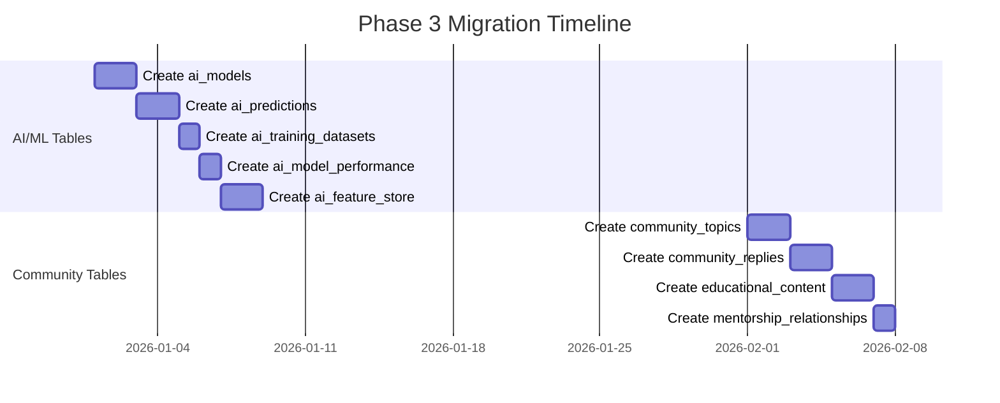

# Database Migration Strategy

## National 1031 Exchange Platform - Phase 2 & 3 Implementation

**Generated by**: Architect Persona  
**Date**: February 2025  
**Purpose**: Systematic approach for deploying schema changes across development phases

---

## 🎯 Migration Overview

This document outlines the migration strategy for implementing Phase 2 (Partner Ecosystem & White-Label) and Phase 3 (AI/ML & Community) database schemas while maintaining zero downtime and data integrity.

---

## 📅 Migration Timeline

### Phase 2A: Partner Ecosystem (Months 7-8)

**Target**: Launch partner program with revenue sharing



### Phase 2B: White-Label Platform (Months 9-12)

**Target**: Enable multi-tenant architecture



### Phase 3: AI/ML & Community (Months 13-18)

**Target**: Advanced features and community platform



---

## 🔄 Migration Scripts

### Phase 2A: Partner Ecosystem Migration

```sql
-- Migration: 2025_07_01_create_partner_ecosystem.sql
BEGIN;

-- Create update_updated_at_column function if not exists
CREATE OR REPLACE FUNCTION update_updated_at_column()
RETURNS TRIGGER AS $$
BEGIN
    NEW.updated_at = NOW();
    RETURN NEW;
END;
$$ language 'plpgsql';

-- Run the partner ecosystem schema
\i 13-phase2-partner-ecosystem.sql

-- Migrate existing leads to include referral tracking
ALTER TABLE leads
ADD COLUMN IF NOT EXISTS referral_partner_id UUID REFERENCES partners(id),
ADD COLUMN IF NOT EXISTS referral_source TEXT,
ADD COLUMN IF NOT EXISTS referral_fee_percentage DECIMAL(5,2);

-- Create indexes for performance
CREATE INDEX CONCURRENTLY idx_leads_referral_partner
ON leads(referral_partner_id)
WHERE referral_partner_id IS NOT NULL;

COMMIT;
```

### Phase 2B: White-Label Migration

```sql
-- Migration: 2025_09_01_create_white_label_platform.sql
BEGIN;

-- Run the white-label schema
\i 14-phase2-white-label.sql

-- Add tenant_id to existing tables with default tenant
DO $$
DECLARE
    default_tenant_id UUID;
BEGIN
    -- Create default tenant for existing data
    INSERT INTO white_label_tenants (
        tenant_subdomain,
        tenant_code,
        brand_name,
        status
    ) VALUES (
        'default',
        'DEFAULT',
        'National 1031 Exchange',
        'active'
    ) RETURNING id INTO default_tenant_id;

    -- Update existing records with default tenant
    UPDATE leads SET tenant_id = default_tenant_id WHERE tenant_id IS NULL;
    UPDATE appointments SET tenant_id = default_tenant_id WHERE tenant_id IS NULL;
    UPDATE documents SET tenant_id = default_tenant_id WHERE tenant_id IS NULL;
    UPDATE subscriptions SET tenant_id = default_tenant_id WHERE tenant_id IS NULL;
END $$;

-- Create tenant isolation function
CREATE OR REPLACE FUNCTION set_current_tenant(tenant_uuid UUID)
RETURNS void AS $$
BEGIN
    PERFORM set_config('app.current_tenant_id', tenant_uuid::text, false);
END;
$$ LANGUAGE plpgsql;

COMMIT;
```

### Phase 3: AI/ML Migration

```sql
-- Migration: 2026_01_01_create_ai_ml_platform.sql
BEGIN;

-- Run the AI/ML schema
\i 15-phase3-ai-ml.sql

-- Create initial AI models
INSERT INTO ai_models (
    model_name,
    model_code,
    model_type,
    model_version,
    business_purpose,
    algorithm,
    deployment_status
) VALUES
(
    'Lead Score Predictor',
    'lead-score-v1',
    'prediction',
    '1.0.0',
    'Predict lead conversion probability',
    'gradient_boosting',
    'development'
),
(
    'Property Value Estimator',
    'property-value-v1',
    'prediction',
    '1.0.0',
    'Estimate property market value',
    'random_forest',
    'development'
);

COMMIT;
```

---

## 🔐 Rollback Strategies

### Automated Rollback Scripts

```sql
-- Rollback: Phase 2A Partner Ecosystem
BEGIN;
-- Remove partner-related columns from leads
ALTER TABLE leads
DROP COLUMN IF EXISTS referral_partner_id,
DROP COLUMN IF EXISTS referral_source,
DROP COLUMN IF EXISTS referral_fee_percentage;

-- Drop partner tables in reverse order
DROP TABLE IF EXISTS partner_referral_links CASCADE;
DROP TABLE IF EXISTS revenue_share_transactions CASCADE;
DROP TABLE IF EXISTS partners CASCADE;
DROP TABLE IF EXISTS partner_organizations CASCADE;
COMMIT;

-- Rollback: Phase 2B White-Label
BEGIN;
-- Remove tenant_id from tables
ALTER TABLE leads DROP COLUMN IF EXISTS tenant_id;
ALTER TABLE appointments DROP COLUMN IF EXISTS tenant_id;
ALTER TABLE documents DROP COLUMN IF EXISTS tenant_id;
ALTER TABLE subscriptions DROP COLUMN IF EXISTS tenant_id;

-- Drop white-label tables
DROP TABLE IF EXISTS communication_preferences CASCADE;
DROP TABLE IF EXISTS communication_sends CASCADE;
DROP TABLE IF EXISTS communication_templates CASCADE;
DROP TABLE IF EXISTS white_label_tenants CASCADE;
COMMIT;

-- Rollback: Phase 3 AI/ML
BEGIN;
-- Drop AI/ML tables
DROP TABLE IF EXISTS ai_feature_store CASCADE;
DROP TABLE IF EXISTS ai_model_performance CASCADE;
DROP TABLE IF EXISTS ai_training_datasets CASCADE;
DROP TABLE IF EXISTS ai_predictions CASCADE;
DROP TABLE IF EXISTS ai_models CASCADE;
COMMIT;
```

---

## 🚀 Performance Optimization During Migration

### 1. Index Creation Strategy

```sql
-- Create indexes CONCURRENTLY to avoid locking
CREATE INDEX CONCURRENTLY idx_name ON table(column);

-- Verify index creation
SELECT schemaname, tablename, indexname, indexdef
FROM pg_indexes
WHERE tablename = 'your_table';
```

### 2. Batch Data Updates

```sql
-- Update existing records in batches to avoid long locks
DO $$
DECLARE
    batch_size INTEGER := 1000;
    offset_val INTEGER := 0;
    total_updated INTEGER := 0;
BEGIN
    LOOP
        WITH batch AS (
            SELECT id FROM leads
            WHERE tenant_id IS NULL
            LIMIT batch_size
            OFFSET offset_val
            FOR UPDATE SKIP LOCKED
        )
        UPDATE leads
        SET tenant_id = 'default-tenant-id'
        WHERE id IN (SELECT id FROM batch);

        GET DIAGNOSTICS total_updated = ROW_COUNT;
        EXIT WHEN total_updated = 0;

        offset_val := offset_val + batch_size;
        PERFORM pg_sleep(0.1); -- Brief pause between batches
    END LOOP;
END $$;
```

### 3. Connection Pool Management

```yaml
# pgbouncer.ini configuration for migration
[databases]
national_1031 = host=localhost port=5432 dbname=national_1031

[pgbouncer]
pool_mode = transaction
max_client_conn = 1000
default_pool_size = 50
reserve_pool_size = 25
reserve_pool_timeout = 5
```

---

## ✅ Pre-Migration Checklist

### Database Health Check

- [ ] Current database size and growth rate documented
- [ ] Backup completed and verified
- [ ] Replication lag < 1 second
- [ ] Connection pool healthy
- [ ] Disk space > 50% free

### Application Readiness

- [ ] Feature flags configured for new functionality
- [ ] Application code deployed but inactive
- [ ] Database connection strings updated
- [ ] Environment variables configured

### Monitoring Setup

- [ ] Query performance baseline captured
- [ ] Alert thresholds configured
- [ ] Dashboard for migration progress created
- [ ] Rollback procedures tested

---

## 🧪 Testing Strategy

### 1. Unit Testing

```sql
-- Test partner referral tracking
BEGIN;
    -- Create test partner
    INSERT INTO partners (email, first_name, last_name)
    VALUES ('test@partner.com', 'Test', 'Partner')
    RETURNING id;

    -- Create lead with referral
    INSERT INTO leads (email, referral_partner_id)
    VALUES ('test@lead.com', [partner_id]);

    -- Verify referral tracking
    SELECT COUNT(*) FROM leads WHERE referral_partner_id IS NOT NULL;
ROLLBACK;
```

### 2. Integration Testing

```sql
-- Test multi-tenant isolation
BEGIN;
    -- Create test tenants
    INSERT INTO white_label_tenants (tenant_subdomain, tenant_code, brand_name)
    VALUES
        ('tenant1', 'T1', 'Tenant One'),
        ('tenant2', 'T2', 'Tenant Two');

    -- Test RLS policies
    SET app.current_tenant_id = 'tenant1-uuid';
    SELECT COUNT(*) FROM leads; -- Should only see tenant1 leads
ROLLBACK;
```

### 3. Performance Testing

```bash
# Load test with pgbench
pgbench -c 50 -j 10 -t 1000 -f migration_test.sql national_1031

# Monitor during test
watch -n 1 'psql -c "SELECT state, count(*) FROM pg_stat_activity GROUP BY state"'
```

---

## 📊 Migration Monitoring

### Real-time Progress Tracking

```sql
-- Create migration progress table
CREATE TABLE migration_progress (
    id SERIAL PRIMARY KEY,
    migration_name TEXT NOT NULL,
    table_name TEXT,
    status TEXT DEFAULT 'pending',
    started_at TIMESTAMPTZ,
    completed_at TIMESTAMPTZ,
    rows_affected INTEGER,
    error_message TEXT
);

-- Function to track migration steps
CREATE OR REPLACE FUNCTION log_migration_step(
    p_migration_name TEXT,
    p_table_name TEXT,
    p_status TEXT,
    p_rows_affected INTEGER DEFAULT NULL,
    p_error_message TEXT DEFAULT NULL
) RETURNS void AS $$
BEGIN
    INSERT INTO migration_progress (
        migration_name, table_name, status,
        started_at, completed_at, rows_affected, error_message
    ) VALUES (
        p_migration_name, p_table_name, p_status,
        CASE WHEN p_status = 'started' THEN NOW() ELSE NULL END,
        CASE WHEN p_status IN ('completed', 'failed') THEN NOW() ELSE NULL END,
        p_rows_affected, p_error_message
    );
END;
$$ LANGUAGE plpgsql;
```

---

## 🚨 Post-Migration Validation

### Data Integrity Checks

```sql
-- Verify referential integrity
SELECT
    'leads.referral_partner_id' as reference,
    COUNT(*) as orphaned_records
FROM leads l
LEFT JOIN partners p ON l.referral_partner_id = p.id
WHERE l.referral_partner_id IS NOT NULL AND p.id IS NULL

UNION ALL

SELECT
    'revenue_share_transactions.partner_id' as reference,
    COUNT(*) as orphaned_records
FROM revenue_share_transactions rst
LEFT JOIN partners p ON rst.partner_id = p.id
WHERE p.id IS NULL;

-- Verify data consistency
SELECT
    'Missing tenant_id in leads' as check_name,
    COUNT(*) as issue_count
FROM leads WHERE tenant_id IS NULL
UNION ALL
SELECT
    'Invalid tenant references' as check_name,
    COUNT(*) as issue_count
FROM leads l
LEFT JOIN white_label_tenants wlt ON l.tenant_id = wlt.id
WHERE l.tenant_id IS NOT NULL AND wlt.id IS NULL;
```

### Performance Validation

```sql
-- Check query performance post-migration
EXPLAIN (ANALYZE, BUFFERS)
SELECT * FROM leads
WHERE referral_partner_id IS NOT NULL
AND created_at > NOW() - INTERVAL '30 days';

-- Monitor table bloat
SELECT
    schemaname,
    tablename,
    pg_size_pretty(pg_total_relation_size(schemaname||'.'||tablename)) as size,
    n_live_tup,
    n_dead_tup,
    round(n_dead_tup::numeric / NULLIF(n_live_tup, 0) * 100, 2) as dead_pct
FROM pg_stat_user_tables
WHERE n_live_tup > 1000
ORDER BY n_dead_tup DESC;
```

---

## 📝 Deployment Notes

### Environment-Specific Configurations

#### Development

```bash
# Run migrations with verbose logging
psql -e -f migration_script.sql > migration_dev.log 2>&1
```

#### Staging

```bash
# Run with timing and transaction control
psql -1 -t -f migration_script.sql -v ON_ERROR_STOP=1
```

#### Production

```bash
# Run with minimal locking and monitoring
psql -h $PROD_HOST -U $PROD_USER -d $PROD_DB \
  -c "SET lock_timeout = '5s';" \
  -c "SET statement_timeout = '30min';" \
  -f migration_script.sql
```

---

## 🎯 Success Criteria

### Phase 2A Success Metrics

- [ ] All partner tables created without errors
- [ ] Zero data loss during migration
- [ ] Query performance maintained (p95 < 100ms)
- [ ] Partner referral tracking functional
- [ ] Revenue sharing calculations accurate

### Phase 2B Success Metrics

- [ ] Multi-tenant isolation verified
- [ ] Tenant data properly segregated
- [ ] Communication system operational
- [ ] No cross-tenant data leakage
- [ ] Performance impact < 10%

### Phase 3 Success Metrics

- [ ] AI models deployed and accessible
- [ ] Prediction storage optimized
- [ ] Community features functional
- [ ] Educational content manageable
- [ ] System stability maintained

---

## 🔧 Maintenance Window Planning

### Recommended Windows

- **Phase 2A**: Sunday 2-6 AM EST (lowest traffic)
- **Phase 2B**: Saturday 11 PM - Sunday 3 AM EST
- **Phase 3**: Weekday 2-5 AM EST (after analysis)

### Communication Plan

1. **T-7 days**: Initial notification to users
2. **T-3 days**: Detailed maintenance window announcement
3. **T-1 day**: Final reminder with support contact
4. **T-0**: Live status page updates
5. **T+1 hour**: Post-migration validation report

---

This migration strategy ensures systematic, safe deployment of new features while maintaining platform stability and performance.
