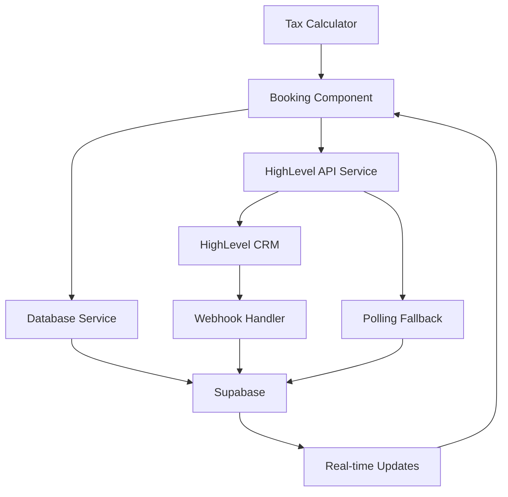

# HighLevel CRM Integration Documentation

## Overview

The National 1031 Center website integrates with HighLevel CRM to provide seamless appointment booking directly from the Tax Savings Calculator. This integration enables automatic lead capture, real-time appointment scheduling, and comprehensive analytics tracking.

## Table of Contents

1. [Architecture Overview](#architecture-overview)
2. [Key Features](#key-features)
3. [System Components](#system-components)
4. [Data Flow](#data-flow)
5. [Security Considerations](#security-considerations)
6. [Performance Characteristics](#performance-characteristics)
7. [Related Documentation](#related-documentation)

## Architecture Overview

The HighLevel integration follows a simplified single-organization architecture with enterprise-grade reliability:



### Design Principles

1. **Reliability First**: Webhook + polling fallback ensures no missed appointments
2. **User Experience**: Seamless flow from calculation to booking
3. **Real-time Updates**: Instant feedback on appointment assignment
4. **Comprehensive Analytics**: Full funnel tracking for optimization
5. **Error Resilience**: Graceful handling of all failure scenarios

## Key Features

### 🚀 Core Capabilities

- **Seamless Calculator Integration**: Direct booking from tax savings results
- **Real-time Appointment Assignment**: Live updates via Supabase subscriptions
- **Reliable Assignment Handling**: Webhook primary, polling fallback
- **Comprehensive Error Handling**: User-friendly messages with retry options
- **Performance Monitoring**: Loading times and submission tracking
- **Mobile-Responsive Design**: Professional booking interface across devices

### 📊 Analytics Integration

- Complete booking funnel tracking
- User behavior analytics (date/time preferences)
- Performance metrics and bottleneck identification
- Error tracking with categorization
- Lead value and conversion tracking

## System Components

### 1. Database Schema (`database/highlevel-schema.sql`)

The database uses PostgreSQL with Supabase, consisting of 4 core tables:

- **`highlevel_config`**: API credentials and configuration
- **`appointments`**: Appointment records with status tracking
- **`webhook_logs`**: Webhook receipt logging
- **`availability_cache`**: Performance optimization cache

### 2. TypeScript Types (`src/lib/types/highlevel.ts`)

Comprehensive type definitions ensuring type safety across the entire integration:

- Appointment status lifecycle types
- API request/response interfaces
- Component prop types
- Error handling types
- Analytics event types

### 3. HighLevel API Service (`src/lib/services/HighLevelService.ts`)

Handles all HighLevel CRM communication:

- Contact creation and deduplication
- Calendar availability fetching
- Appointment creation
- Status polling for fallback
- Error handling with retries

### 4. Database Service (`src/lib/services/DatabaseService.ts`)

Manages all database operations:

- CRUD operations for appointments
- Real-time subscription management
- Webhook log management
- Availability caching
- Supabase client singleton

### 5. Appointment Booking Component (`src/components/booking/AppointmentBooking.tsx`)

React component providing the complete booking UI:

- Date selection interface
- Time slot selection
- Booking confirmation
- Real-time status updates
- Error state handling
- Mobile-responsive design

### 6. Appointment Poller (`src/lib/utils/appointmentPoller.ts`)

Intelligent polling system for reliability:

- Exponential backoff strategy
- Maximum 10 attempts
- Direct API fallback
- Abort controller for cleanup
- Performance optimization

### 7. Webhook Handler (`netlify/edge-functions/highlevel-webhook.ts`)

Netlify Edge Function for webhook processing:

- Signature verification
- Appointment status updates
- Database updates
- Error logging
- Edge deployment for low latency

### 8. Booking Analytics (`src/lib/analytics/bookingAnalytics.ts`)

Comprehensive event tracking:

- Funnel step tracking
- Performance monitoring
- Error categorization
- User behavior analytics
- Integration with GA4/GTM

## Data Flow

### 1. Booking Initiation

```
User completes tax calculation
    ↓
Lead data passed to booking component
    ↓
Available dates loaded from HighLevel
    ↓
User selects date and time
```

### 2. Appointment Creation

```
User confirms booking
    ↓
Contact created/updated in HighLevel
    ↓
Appointment created in HighLevel
    ↓
Record saved to Supabase
    ↓
Real-time subscription established
    ↓
Polling fallback timer started
```

### 3. Assignment Flow

```
HighLevel assigns specialist (round-robin)
    ↓
Webhook sent to Edge Function
    ↓
Database updated with assignment
    ↓
Real-time update to UI
    ↓
User sees confirmation
```

### 4. Fallback Flow

```
If webhook not received within 2 minutes
    ↓
Polling begins with exponential backoff
    ↓
Direct API check after max attempts
    ↓
Database updated
    ↓
UI updated via subscription
```

## Security Considerations

### API Security

- **Credentials**: Stored as environment variables
- **Webhook Verification**: HMAC-SHA256 signature validation
- **HTTPS Only**: All API communication encrypted
- **Rate Limiting**: Built-in retry logic with backoff

### Database Security

- **Row Level Security**: Supabase RLS policies
- **Encrypted Connections**: SSL/TLS for all database traffic
- **API Key Rotation**: Support for key rotation without downtime
- **Audit Logging**: All webhook events logged

### Frontend Security

- **No Sensitive Data**: API keys never exposed to frontend
- **Input Validation**: All user inputs validated
- **XSS Protection**: React's built-in protections
- **CORS Configuration**: Proper origin restrictions

## Performance Characteristics

### Loading Performance

- **Availability Loading**: <1s typical, 3s maximum
- **Appointment Creation**: <2s typical, 5s timeout
- **Real-time Updates**: <100ms via subscriptions
- **Polling Intervals**: 5s base, 60s maximum

### Optimization Strategies

1. **Availability Caching**: 1-minute cache for calendar data
2. **Database Indexing**: Optimized queries on appointment lookups
3. **Edge Function Deployment**: Low-latency webhook processing
4. **Batch Operations**: Efficient date grouping
5. **Lazy Loading**: Components loaded as needed

### Scalability Considerations

- **Database**: Supabase auto-scaling
- **API Rate Limits**: Respects HighLevel limits
- **Webhook Processing**: Edge Functions scale automatically
- **Polling Management**: Singleton pattern prevents duplication

## Related Documentation

### Setup & Configuration
- [HIGHLEVEL_SETUP.md](./HIGHLEVEL_SETUP.md) - Step-by-step setup guide
- [HIGHLEVEL_CONFIG.md](./HIGHLEVEL_CONFIG.md) - Configuration reference

### Development
- [HIGHLEVEL_API.md](./HIGHLEVEL_API.md) - API reference documentation
- [HIGHLEVEL_COMPONENTS.md](./HIGHLEVEL_COMPONENTS.md) - Component usage guide

### Operations
- [HIGHLEVEL_WEBHOOKS.md](./HIGHLEVEL_WEBHOOKS.md) - Webhook configuration
- [HIGHLEVEL_TROUBLESHOOTING.md](./HIGHLEVEL_TROUBLESHOOTING.md) - Common issues

### Analytics
- [ANALYTICS.md](./ANALYTICS.md) - Analytics implementation guide
- [HIGHLEVEL_ANALYTICS.md](./HIGHLEVEL_ANALYTICS.md) - Booking analytics guide

## Quick Links

- [HighLevel API Documentation](https://highlevel.com/api-docs)
- [Supabase Documentation](https://supabase.com/docs)
- [Netlify Edge Functions](https://docs.netlify.com/edge-functions/overview/)

## Support

For questions or issues with the HighLevel integration:

1. Check the [Troubleshooting Guide](./HIGHLEVEL_TROUBLESHOOTING.md)
2. Review error logs in Supabase dashboard
3. Contact technical support with appointment ID and error details

---

*Last Updated: January 2025*
*Version: 1.0.0*